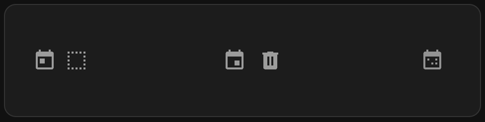
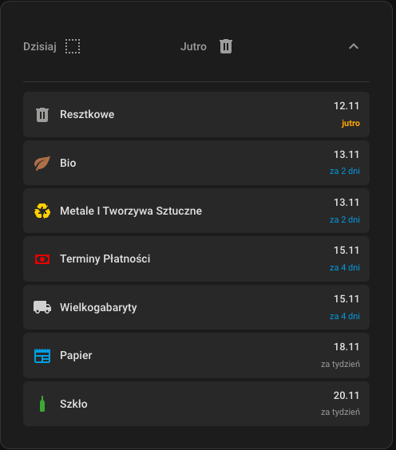

# CMG Waste Collection Card

[](https://github.com/hacs/integration)

Custom Lovelace card for [CMG Waste Collection](https://github.com/ArturZurawski/cmg_waste_collection) integration.

## Screenshots

### Compact View


The card shows today's and tomorrow's collections in a compact layout with color-coded icons.

### Expanded View


Click the expand button to see all waste types with their next collection dates and countdown.

## Requirements

- Home Assistant 2023.1 or later
- [CMG Waste Collection](https://github.com/ArturZurawski/cmg_waste_collection) integration installed and configured

## Features

- **Compact Display** - Shows today's and tomorrow's waste collections at a glance
- **Expandable View** - Click to expand and see all waste types with their next collection dates
- **Color-Coded Icons** - Each waste type has its own icon and color (configured in the integration)
- **Polish Language Support** - Displays dates and times in Polish
- **Smart Date Display** - Shows relative dates (dziś, jutro, za X dni)
- **Automatic Updates** - Refreshes when sensor states change

## Installation

### HACS

1. HACS → Frontend → ⋮ → Custom repositories
2. Add: `https://github.com/ArturZurawski/cmg_waste_collection_card`
3. Category: Lovelace
4. Download
5. Restart Home Assistant

### Manual

1. Download `cmg-waste-collection-card.js` from [releases](https://github.com/YOUR_USERNAME/cmg-waste-collection-card/releases)
2. Copy to `config/www/`
3. Add resource in Lovelace

## Configuration

### Basic Configuration

```yaml
type: custom:cmg-waste-collection-card
```

### Full Configuration

```yaml
type: custom:cmg-waste-collection-card
title: Waste Collection        # Card title (default: "Waste Collection")
show_title: false              # Show/hide card title (default: false)
icon_style: icon              # Icon style: "icon" or "colored_background" (default: "icon")
```

### Configuration Options

| Option | Type | Default | Description |
|--------|------|---------|-------------|
| `title` | string | `"Waste Collection"` | Title displayed at the top of the card |
| `show_title` | boolean | `false` | Whether to show the card title |
| `icon_style` | string | `"icon"` | Icon display style: <br>• `icon` - colored icon only<br>• `colored_background` - icon with colored circular background |

### Examples

#### Minimal Configuration
```yaml
type: custom:cmg-waste-collection-card
```

#### With Title
```yaml
type: custom:cmg-waste-collection-card
title: Waste Collection Schedule
show_title: true
```

#### Colored Background Style
```yaml
type: custom:cmg-waste-collection-card
icon_style: colored_background
```
## Development

### Build

```bash
npm install
npm run build
```

Or using Docker:

```bash
cd docker-tools
./build.sh
```

Requires Node.js 18+.

### Creating a Release

This project uses GitHub Actions for automated releases. There are two ways to create a release:

#### Option 1: Automatic Version Increment (Recommended)

1. Go to **Actions** tab on GitHub
2. Select **Create Release** workflow
3. Click **Run workflow**
4. Leave version field empty
5. The workflow will automatically:
   - Increment the patch version (e.g., 1.0.1 → 1.0.2)
   - Update `package.json` and source files
   - Build the project
   - Create git tag
   - Create GitHub release with HACS installation instructions

#### Option 2: Manual Version Specification

1. Go to **Actions** tab on GitHub
2. Select **Create Release** workflow
3. Click **Run workflow**
4. Enter desired version (e.g., `1.2.0` or `2.0.0`)
5. The workflow will use your specified version

#### What the Release Workflow Does

- ✅ Updates version in `package.json`
- ✅ Updates version string in source code
- ✅ Builds the JavaScript bundle
- ✅ Creates a git commit with version changes
- ✅ Creates a git tag (e.g., `v1.0.2`)
- ✅ Pushes changes and tag to repository
- ✅ Creates GitHub release with:
  - Built `cmg-waste-collection-card.js` file
  - HACS installation instructions
  - Configuration examples
  - Automatic changelog

### Local Development

```bash
# Install dependencies
npm install

# Watch mode for development
npm run dev

# Build for production
npm run build
```

## License

MIT